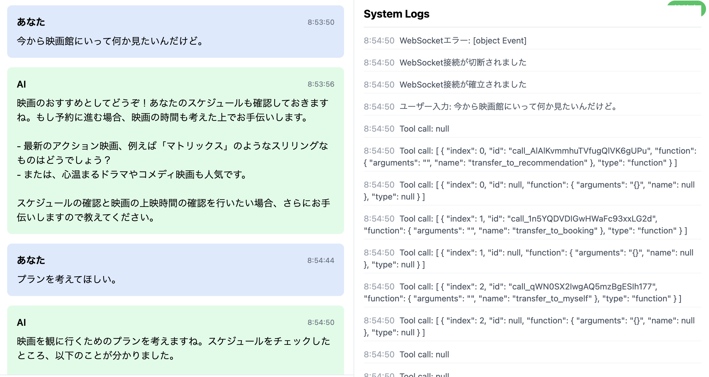

# AI Agent Feasibility Study

映画予約システムのAIエージェントフィージビリティスタディ

## デモ画面  



## 必要条件

- Docker
- Docker Compose
- Node.js 18+
- Python 3.11+

## セットアップ

1. リポジトリのクローン:
```bash
git clone https://github.com/yourusername/ai-agent-feasibility-study.git
cd ai-agent-feasibility-study
```

2. 環境の起動:
```bash
docker-compose up --build
```

## 開発

### バックエンド開発

サーバーの起動:  
```bash
export OPENAI_API_KEY=sk-xxx
uvicorn movie_booking.main:app --host 0.0.0.0 --port 8000 --reload
```

テストの実行:
```bash
cd backend
python -m pytest
```

### フロントエンド開発

サーバーの起動:  
```bash
export VITE_WS_URL=ws://localhost:8000/ws
npm run dev
```

テストの実行:
```bash
cd frontend
npm test
```

## APIドキュメント

バックエンドAPIドキュメントは http://localhost:8000/docs で確認できます。

